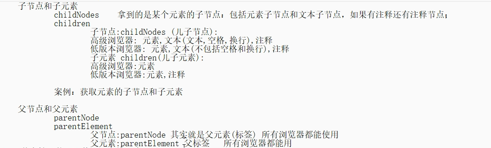

# 1.点击事件修改元素属性

## 1.切换图片路径


## 2.切换超链接


## 3.切换多选框是否选中


## 4. .语法和setAttribute的区别


## 5.保留字class


## 6.this练习


# 2.获取元素的其他方法

```js
		<p class="pp" id="ppp">1</p>
		<p class="pp">2</p>
		<p class="pp">3</p>
		<p class="pp">4</p>
		
		<script type="text/javascript">
      var p=document.getElementById('ppp')//选择单个
			var pList=document.getElementsByTagName('p')//通过标签名选，返回数组
			var pList2=document.getElementsByClassName('pp')//通过类名选，返回数组
			
      //通过选择器选择（.pp,#ppp）,注意IE8一下不支持
			var p2=document.querySelector('.pp')//选一个
			var pList4=document.querySelectorAll('.pp')//选多个
		</script>
```

# 3.innerHTML,innerText，textContext区别

```js
1.innerHTML,innerText
输入时:
 d.innerHTML='<h1>哈哈哈</h1>';//转义   
 d.innerText='<h1>哈哈哈</h1>';//不转义，原样输出
输出时：
	1.标签内部带标签
  	innerHTML：会输出标签带文本
    innerText：只会输出文本
  2.标签内部不带标签：
  	innerHTML：带空格和换行输出文本
    innerText：只会输出文本
```

```js
2.innerText，textContent
<p style="visibility: hidden;">ahaha</p>
<p>dddddd</p>
输出时：
	innerText：不能获取隐藏的文本，不包含换行和空白
  textContent：可以获取隐藏的文本，包含换行和空白
```

# 4.排他操作

```js
定义：
	其他项统一，当前项不统一
 
操作步骤“
	1.先将所有的项都全部统一
  2.将当前项改成不统一
```


# 5.常用鼠标事件

```js
onclick/ondbClick(单击，双击)
onmouseover/onmouseout(移入，移出)
onmouseenter/onmouseleave(移入，移出)
onmousedown/onmouseup
onmousemove(移动)
```

# 6.常用键盘事件

```js
keyup/keydown
```

# 7.事件对象


# 8.获取失去焦点

```js
onfocus/onblur
```

## 1.div如何获取焦点

```js
div本身是无法获取焦点的，需要添加一个属性才能添加焦点

//添加tabindex后可以获取焦点
<div tabindex="100">
			
</div>
```


# 9.二级菜单

```js
难点:
	对应的li要对应，自己的二级菜单
  
  也就是li的下标要与二级菜单的下标相同
  
解决：
	在每个li,将他的下标保存到属性中，便于二级菜单获取下标
	list[i].index=i;

	list2[this.index]
```

# 10.节点

```js
		<div id="d">
			<span></span>
			<span></span>
			<span></span>
		</div>
		
		<script type="text/javascript">
			//两个特殊的节点：html和body
			//根节点的子元素不包含首尾的空格
			var htmlNode=document.documentElement;
			var bodyNode=document.body;
			console.log(htmlNode.childNodes,bodyNode.childNodes)
			
			var d=document.getElementById('d')
			var dList=d.childNodes;
			var dList2=d.children
			for(var i=0;i<dList2.length;i++){
				//nodeName:节点名
				//nodeType:节点类型
				//nodeValue:节点值
				//总共有12中节点对应1-12
				console.log(dList2[i].nodeName+"----"
				+dList2[i].nodeType+"----"+
				dList2[i].nodeValue)
			}
			// console.log(dList)
			// console.log(dList2)
		</script>
```





```js
兼容性封装：获取第一/最后一个元素节点

<ul>
			<li></li>
			<li></li>
			<li></li>
		</ul>
		<script type="text/javascript">
			var u=document.querySelector('ul')
			
			function getFitstElement(obj){
				if(obj.firstElementChild){
					return obj.firstElementChild;
				}else{
					var fistNode=u.firstChild
          //当第一个节点存在且为元素节点时，停止循环
					while(fistNode && fistNode.nodeType==1){
						var testNode=fistNode.nextSibling;
					}
					return testNode;
				}
			}
		</script>
```

# 11.创建节点的三种方式

## 1.document.write()

```js
完全不用：
document.write()只能在页面加载的过程中使用,如果当页面加载完后,再使用会将其它的dom干掉
```

## 2.obj.innerHTML

​	

```JS
obj.innerHTML:
也会对当前节点内容进行覆盖，需要将所有需要展示的内容进行拼接字符串
```

## 3.createElement,appendChild创建列表

```js
		<script type="text/javascript">
			var arr=['哪吒','烈火英雄','上海堡垒','速度与激情']
			//创建元素节点
			var uNode=document.createElement('ul');
			for(var i=0;i<arr.length;i++){
				var lNode=document.createElement('li');
        //赋值	
				lNode.innerText=arr[i];
        //追加元素节点
				uNode.appendChild(lNode);
			}
			//追加元素节点
			document.body.appendChild(uNode);
		</script>
```

# 12.节点的增删改查

```js
<ul>
			<li>哪吒</li>
			<li>烈火英雄</li>
			<li>上海堡垒</li>
		</ul>
		<script type="text/javascript">
			//末尾新增节点
			var uNode=document.querySelector('ul');
			var lNode=document.createElement('li');
			lNode.innerText='速度与激情'
			uNode.appendChild(lNode);
			//插入节点
			var uNode=document.querySelector('ul');
			var l=document.querySelector('ul li:last-child')
			var lNode=document.createElement('li');
			lNode.innerText='速度与激情2'
			//第一个参数:新节点，第二个参数：参考节点
			uNode.insertBefore(lNode,l)
			
			//替换节点
			var uNode=document.querySelector('ul');
			var l=document.querySelector('ul li:last-child')
			var lNode=document.createElement('li');
			lNode.innerText='速度与激情3'
			uNode.replaceChild(lNode,l)
			
			//删除节点
			var uNode=document.querySelector('ul');
			var lNode=document.querySelector('ul li:last-child');
			uNode.removeChild(lNode)
		</script>
```

# 13.事件的绑定与解绑，与兼容浏览器

```js
<script type="text/javascript">
			//dom0(pc)和dom2(app)在事件绑定上的区别
			//dom0，同一个对象不能添加多个事件，覆盖
			//兼容所有的浏览器
			var foot=document.querySelector('#footer')
			foot.onclick=function(){}
			
			//解绑：foot.onclick=null
			
			
			//dom2，同一个对象可以添加多个事件
			//兼容高级浏览器，IE10以下不支持
			//第一个参数：事件名，不加on
			//第二个参数：回调函数
			//第三个参数：是否冒泡
			1.foot.addEventListener('click',function(){},false)
			2.foot.addEventListener('click',fn,false)
			function fn(){}
			
			//解绑：
			foot2.addEventListener('click',function(){
				foot.removeEventListener('click',fn,false)
			},false)
			
			
			//IE低版本
			foot.attachEvent('onclick',function)
			foot.detachEvent('onclick',function)
			
			
			//重点：回调函数指向时，不需要加括号
			//例如:
				foot.onclick=fn//此处不能加括号，由系统自动调用，不需要我们自己主动调用
				function fn(){}
		</script>
```

# 14.事件流

```js
事件流：
	捕获事件流（网景公司）几乎不用
  冒泡事件流（ie）常用
  
 标准dom事件流(dom2)：捕获和冒泡可以由我们自己选择
 	1.捕获阶段
  2.找到
  3.冒泡阶段
  
  dom0：默认使用冒泡
```


# 15.阻止事件冒泡以及兼容处理

```js
<script type="text/javascript">
			btn.onclick=function(event){
				//在大部分浏览器中event是可以直接使用的，但是有部分ie的
				//event事件对象是放在window.event下的
				//兼容处理事件对象
				event=event || window.event
				
				//阻止冒泡
				event.stopPropagation()
			}
		</script>
```

# 16.事件冒泡的应用（事件委派）

```js
事件委派：
	原理：冒泡机制
  应用场景：点击新增，同时新增的和原来的要具有相同的行为
  操作：通过给父元素添加时间委派，寻找发生事件的子元素，然后控制其行为
  优势：避免通弄遍历时，给每个新增元素添加事件，节省了大量的内存
```

```js
案例：输入框回车键入，新增列表，同时列表移入移出变色
重点：此处应该注意onmouseover和onmouseenter的区别使用
<div id="footer">
			<input type="text" name="" id="sin" value="" />
			<ul>
				
			</ul>
		<script type="text/javascript">
			var inNode=document.querySelector('#sin')
			var uNode=document.querySelector('ul')
      //事件委派
			uNode.onmouseover=function(event){
        //兼容event
				event=event || window.event
        //寻找新增的子元素，并且兼容处理
				var l=event.target || event.srcElement
				console.log(l.innerText)
				l.style.backgroundColor='hotpink'
			}
 			//事件委派
			uNode.onmouseout=function(event){
				event=event || window.event
        //寻找新增的子元素
				var l=event.target
				l.style.backgroundColor='white'
			}
			//键盘事件
			inNode.onkeydown=function(event){
				event=event || window.event
				if(event.keyCode==13){
					var lNode=document.createElement('li')
					lNode.innerText=inNode.value
					uNode.appendChild(lNode)
					inNode.value=''
				}
			}
			
		</script>
```


# 17.onmouseenter和onmouseover的区别

```js
区别：
	onmouseenter：进入子元素时，不会有移出父元素，移入子元素的切换
  过程演示： 移入父元素
           移入子元素
  					
  onmouseover：进入子元素时，会有移出父元素，移入子元素的切换
  过程演示： 移入父元素
  			   移出父元素
           移入子元素
           移入父元素
```


# 18.bom（浏览器模型）


# 19.鼠标位置

```js
	client，offset，page的区别，screen
  
  client：相对于当前看到的窗口左上角
  	event.clientX和clientY
  offset：当前元素的左上角
  	event.offsetX和offsetY
  page:：整个页面的左上角
  	event.pageX和pageY
  screen：相对于屏幕的左上角
  	event.screenX和screenY
```

# 20.定时器(异步)

```js
单次定时器：
setTimeout是延时定时器，是window下的一个全局方法，两个参数
//第一个参数：回调函数，也就是到时间你想干嘛
//第二个参数：时间，毫秒为单位
var time=setTimeout(function(){
  
},5000)

//清除定时器
clearTimeout(time)


循环定时器：
var interval=setInterval(function(){
  
},3000)

//清除循环定时器
clearInterval(interval)
```

# 21.元素大小

```js
			//总结：
			//当box2内容未超过盒子时
			offsetWidth:width+padding+border*2,
			clientWidth:width+paading
			scrollWidth:width+paading
			
			//当box2内容超过盒子时
			offsetWidth:width+padding+border*2,
			clientWidth:width+paading,
			scrollWidth:盒子内的box2的offsetWidth+盒子box1
			的内边距
       
      //拿到盒子的边框的大小
			box.clientLeft
			box.clientTop
			
			//拿到盒子的水平偏移量和垂直偏移量：其实就是拿这个元素设置的定位的left值和top值
			//相对也就是离他最近的	定位的祖先的原点（左上角）
			//通常我们依赖偏移量去读取元素的位置（只要用到了offsetLeft或者offsetTop就一定和定位相关）
			box.offsetLeft
			box.offsetTop
			
			//读、写滚动条的距离
			box.scrollLeft
			box.scrollTop
```

```js
Offset系列    只读 
			offsetWidth      拿的是盒子   内容 + padding + border的宽；
			offsetHeight   	 拿的是盒子   内容 + padding + border的高；

			offsetLeft       拿的是元素的偏倚量：可以认为就是拿的定位left值
			offsetTop        拿的是元素的偏倚量：可以认为就是拿的定位top值
				
Client系列    只读
			clientWidth      拿的是盒子   内容 + padding的宽；
			clientHeight     拿的是盒子   内容 + padding的高；

			clientLeft       拿的是盒子左边框大小；
			clientTop        拿的是盒子上边框大小；
			
			视口宽高求法   
					document.documentElement.clientWidth
					document.documentElement.clientHeight
Scroll系列
			scrollWidth   只读  
					//当内容比盒子小的时候，拿的是盒子的clientWidth
//					//当内容比盒子大的时候，拿的是内容的offsetWidth + 盒子的一侧内边距； 
			scrollHeight  只读
					//当内容比盒子小的时候，拿的是盒子的clientHeight
//					//当内容比盒子大的时候，拿的是内容的offsetHeight + 盒子的一侧内边距；

			scrollTop     可写
					//拿的是盒子内容向上滚动的距离
			scrollLeft    可写
					//拿的是盒子内容向左滚动的距离	

		元素的大小：宽和高的获取；
		以后我们拿元素的宽和高 先看元素有没有边框   如果没有边框    那么clientWidth和offsetWidth是一样的
					如果有边框，看你需要不，需要的话就用offsetWidth 不需要就用clientWidth;
					scrollWidth几乎不用；
```

# 22.系统滚动条事件（window.onscroll）

```js
<div id="header">
		</div>
		<script type="text/javascript">
			//系统滚动条事件
			window.onscroll=function(){
      	//获取滚动条的值，兼容处理
				var box=document.documentElement.scrollTop ||  document.body.scrollTop
				if(box>=600){
					var header=document.querySelector('#header')
					header.style.position='fixed'
					header.style.left='0px'
					header.style.top='0px'
				}
				if(box<600){
					var header=document.querySelector('#header')
					header.style.position=''
					header.style.left=''
					header.style.top=''
				}
			}
		</script>
```

# 23.初始包含块


```js
页面最外层不是html而是初始包含块

当定义了position：absolute时，如果父容器没有定义相对路径，则相对于初始包含块，进行定位
```

# 24.系统滚动条控制

```js
 html和body这两个元素overflow的scroll属性，控制着系统的滚动条
        系统的滚动条有两个，一个是body身上的  一个是document身上的。我们平时看到的那个滚动条
        是document身上的。，如果我们想要控制系统滚动条哪个显示哪个关闭分以下情况：

        1、单独的给body或者html 设置overflow:scroll  滚动条打开的全部都是document的

        2、如果两个元素同时设置overflow属性，body设置的是scroll,html设置是hidden,那么
        document的滚动条被关闭，body身上的滚动条会打开。相反，body身上被关闭，document身上的被打开。

        3、如果两个元素同时设置overflow:hidden；那么系统的两个滚动条全部被关闭；

        4、如果两个都设置overflow:scroll,那么html会打开document身上的，而body会打开自己身上的滚动条；

        由此我们也引出如何禁止系统的滚动条：


	html,body{
		height:100%;    //这个属性加上只是为了让设置的overflow:hidden;更有说服力，只有内容超出才会被掩藏或者出现滚动条
				//如果不设置，那么body和html高度将由内容自动撑开，也就是说body当中的内容永远不会溢出。
		overflow:hidden;
	}
```

# 25.拖拽注意点

```js
1.拖拽注意鼠标位置的变化
2.元素位置的移动
3.处理包含文字时拖拽的默认行为
4.兼容ie
5.快速移动过程中会掉落的问题（事件冒泡 document）
6.临界值计算

7.拖拽碰撞:document.getBoundingClientRect()
	碰撞判定需要在确定位置以后

var mNode=document.querySelector('#header')
			
			mNode.onmousedown=function(event){
				event=event || window.event
				var eleX=mNode.offsetLeft;
				var eleY=mNode.offsetTop;
				var startX=event.clientX;
				var startY=event.clientY;
				
				
				//元素发生事件后，之后鼠标发生的所有事件行为都被捕获到该元素身上
				mNode.setCapture && mNode.setCapture()
        //利用事件冒泡处理拖拽时元素掉落
				document.onmousemove=function(event){
					event=event || window.event
					var endX=event.clientX;
					var endY=event.clientY;
					var disX=endX-startX;
					var disY=endY-startY;
					
					var lastX=eleX+disX;
					var lastY=eleY+disY;
          
          //临界值计算
					var maxWidth=document.documentElement.clientWidth-mNode.offsetWidth
					var maxHeight=document.documentElement.clientHeight-mNode.offsetHeight
					
					if(lastX>maxWidth){
						lastX=maxWidth
					}else if(lastX<0){
						lastX=0
					}
					if(lastY>maxHeight){
						lastY=maxHeight
					}else if(lastY<0){
						lastY=0
					}
          //最终位置
					mNode.style.left=lastX+'px';
					mNode.style.top=lastY+'px';
          
          //获取定位图片距离视口的左，上距离
					//getBoundingClientRect()返回一个包含left，top属性的对象
					var iNode=document.getBoundingClientRect().left
					var tNode=document.getBoundingClientRect().right
				}
				document.onmouseup=function(){
					document.onmousemove=document.onmouseup=null
					mNode.releaseCapture && mNode.releaseCapture()
				}
				
				//去除demo0默认行为
				return false
				
				//去除demo2默认行为
				event.preventDefault();
				
				//ie默认行为不包含拖拽
			}
```

# 26.<span style='color:red;background:背景颜色;font-size:文字大小;font-family:字体;'>*</span>自定义滚动条

```js
核心原理：拖拽

注意点：
	1.边界
  2.滚动条与内容的比例
  3.滚动条的移动方向与内容的方向相反
  
  
 比例:滚动条的高度/屏幕的高度=屏幕的高度/内容的高度=滚动条的移动距离/内容的移动距离
 屏幕的高度:	clientHeight
 内容的高度: offsetHeight
 滚动条的移动距离:var lastTop=scrollIn.offsetTop+step
 		
 需要求：
 		滚动条的高度=屏幕的高度*（屏幕的高度.clientHeight/内容的高度.offsetHeight）
		滚动条的移动距离:var lastTop=scrollIn.offsetTop+step
    内容的移动距离：-lastTop

*******
屏幕的高度/内容的高度：var scale=document.documentElement.clientHeight/content.offsetHeight
滚动条的高度：var scorllHeight=scale*document.documentElement.clientHeight+'px'
滚动条的移动距离:var lastTop=scrollIn.offsetTop+step
内容的移动距离:-lastTop

*******
边界判定：
	上边界：if(lastTop<0){
					lastTop=0
				}
	下边界：if(lastTop+scrollIn.offsetHeight>document.documentElement.offsetHeight){
					lastTop=document.documentElement.offsetHeight-scrollIn.offsetHeight
				}

```

```html
<!DOCTYPE html>
<html>
	<head>
		<meta charset="utf-8">
		<title></title>
		<style type="text/css">
			*{
				margin: 0;
				padding: 0;
			}
			html,body{
				height: 100%;
				overflow: hidden;
			}
			#wrap{
				position: relative;
				height: 100%;
				overflow: hidden;
				position: relative;
			}
			#wrap #scroll{
				position: absolute;
				right: 0;
				top: o;
				width: 30px;
				height: 100%;
				border: 1px solid #FAEBD7;
				
			}
			#wrap #scroll #scrollIn{
				position: absolute;
				left: 50%;
				transform: translateX(-50%);
				top:0;
				width: 26px;
				height: 70px;
				background-color: aqua;
				margin: 0 auto;
			}
			#wrap #content{
				position: absolute;
				top: 0;
				left: 0;
			}
		</style>
	</head>
  
	<body>
		<div id="wrap">
			<div id="scroll">
				<div id="scrollIn">
				</div>
			</div>
			<div id="content">
				
			</div>
		</div>
		
		
		<script type="text/javascript">
			/* 
			 ie/chrome:mousewheel(demo标准事件)
				event：wheelDelta
				上：150
				下：-150
				
			firefox：DOMMOuseScroll(demo2标准事件)
				evnet.detail
				上：-3
				下：3
			 
			 */
			var content=document.querySelector('#content')
			for(var i=0;i<200;i++){
				content.innerHTML+=i+'<br>'
			}
			
			
			var scrollIn=document.querySelector('#scrollIn')
			
			var scale=document.documentElement.clientHeight/content.offsetHeight
			var scorllHeight=scale*document.documentElement.clientHeight
			scrollIn.style.height=scorllHeight+'px'
			
			//添加拖拽
			scrollIn.onmousedown=function(event){
				event=event || window.event
				//获取当前元素位置
				var startX=scrollIn.offsetLeft
				var startY=scrollIn.offsetTop
				//获取当前鼠标位置
				var mouX=event.clientX
				var mouY=event.clientY
				
				//兼容ie低版本拖拽
				scrollIn.setCapture && scrollIn.setCapture()
				//添加移动事件
				document.onmousemove=function(event){
					event=event || window.event
					//获取当前鼠标位置
					var endX=event.clientX
					var endY=event.clientY
					//获取移动的距离
					var disX=endX-mouX
					var disY=endY-mouY
					//计算距离
					var finX=disX+startX
					var finY=disY+startY
					
					scrollIn.style.left=startX
					
					//判断临界值
					if(finY<0){
						finY=0
					}else if(finY+scrollIn.offsetHeight>=document.documentElement.clientHeight){
						finY=document.documentElement.clientHeight-scrollIn.offsetHeight
					}
					//设置属性
					scrollIn.style.top=finY+'px'
					content.style.top=-finY/scale+'px'
				}
				
				//添加鼠标抬起事件
				document.onmouseup=function(){
					document.onmousemove=null
					scrollIn.releaseCapture && scrollIn.releaseCapture()
				}
				
				//去除默认事件
				return false;
				//dom2事件取消默认行为
				event.preventDefault();
				
			}
			
      //demo2添加滚轮事件
			document.addEventListener('mousewheel',fn)
			document.addEventListener('DOMMOuseScroll',fn)
			
			
			function fn(event){
				var flag=true;
				var step=10
				if(event.wheelDelta){
					//chrome
					if(event.wheelDelta>0){
						//上
						flag=false
						step=-10
					}else{
						//下
						flag=true
						step=10
					}
				}else{
					//firefox
					if(event.DOMMOuseScroll>0){
						//上
						flag=false
						step=-10
					}else{
						//下
						flag=true
						step=10
					}
				}
				var lastTop=scrollIn.offsetTop+step
				
				if(scrollIn.offsetTop+step<0){
					lastTop=0
				}else if(scrollIn.offsetTop+scrollIn.offsetHeight+step>document.documentElement.offsetHeight){
					lastTop=document.documentElement.offsetHeight-scrollIn.offsetHeight
				}
        
				scrollIn.style.top=lastTop+'px'
				content.style.top=-lastTop/scale+'px'
			}
		</script>
	</body>
</html>

```

