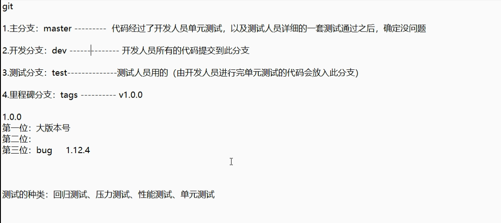
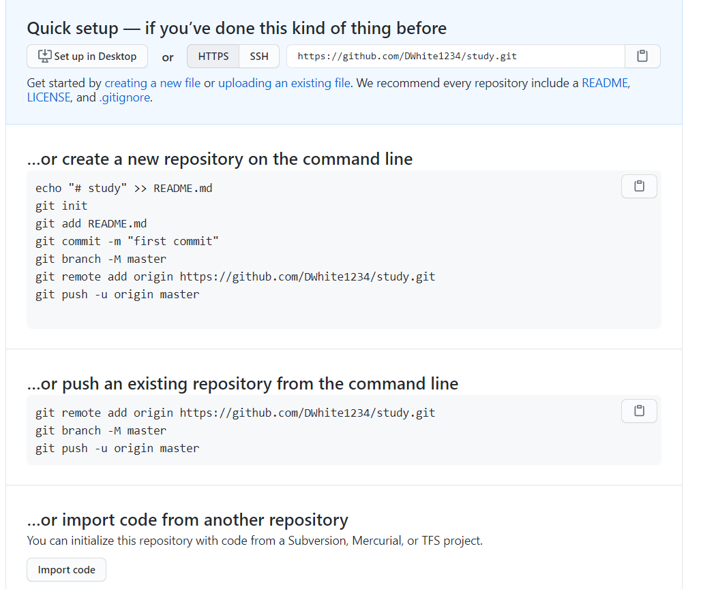
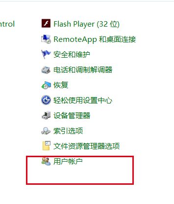
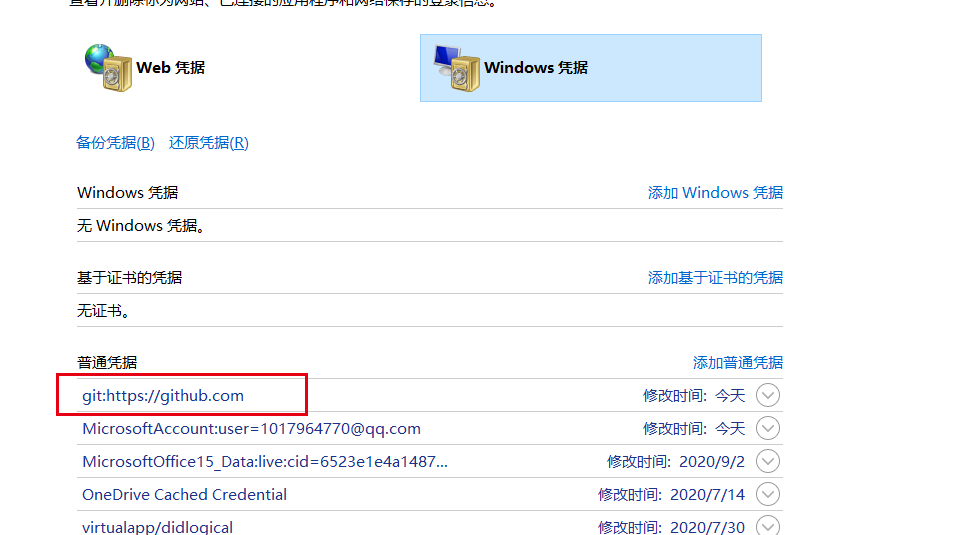

# 1.安装

```js
1.全选默认
2.安装后右击桌面选择bash.exe
3.配置用户名，邮箱
	git config --global user.name "zt"
	git config --global user.email "ztowork9696@163.com"
4.查看用户名，邮箱
	git config user.name
	git config user.email
```

# 2.git的配置文件地址

```js
C:\Users\10179\.gitconfig
```

# 3.初始化git仓库

```js
1.创建一个新的文件夹(text)
mkdir text
2.进入文件夹
cd text
3.初始化仓卡
git init
```

# 4.提交代码

```js
1.提交到暂存区
git add a.txt

	提交多个文件
git add *或者.
2.提交到版本区
git commit -m 'this is NO.1 commit'

3.查看代码提交情况
git status
未提交：红色
提交到暂存区：绿色
提交到版本去：无
```

# 5.差异对比

```js
对比暂存区和工作区同名文件：git diff

对比暂存区和版本区：git diff --cached

对比工作区和版本区：git diff master(分支同名)
```


# 6.查看提交日志

```js
1.查看详细日志从最近到最远
git log

2.查看简略日志
git reflog
```

# 7.版本回退

```js
1.回退一次
git reset --hard HEAD^

2.回退到指定版本
git reset --hard 版本号
```

```js
下面的基本不用，同时也很危险，会修改工作区的代码

1.用版本库的文件去替换暂存区的全部文件
git reset HEAD

2.用暂存区的文件去替换工作区的指定文件
git checkout -- x.txt

3.用版本库的文件去替换暂存区和工作区的文件
git checkout HEAD x.txt

4.删除暂存区的文件
git rm --cached x.txt
```

# 8.删除文件

```js
1.删除文件
git rm a.txt
2.删除文件夹（不能为空，为空会被忽略）
git rm -f xxxx
```

# 9.分支图解



# 10.分支操作

```js
1.创建一个分支
git checkout -b 分支名

2.查看当前分支
git branch 

3.切换分支
git checkout 分支名

4.合并分支
git merge 分支名

5.删除分支
git branch -d 分支名

6.比较分支间的所有差异分拣
git diff 分支1 分支2 

7.显示分支间的差异文件列表
git diff 分支1 分支2 --stat

8.显示指定文件的详细差异
git diff 分支1 分支2 文件名	
```

# 11.github创建远程仓库



# 12.关联远程仓库

```js
1.将本地库连接远程库
git add origin(别名，可更改) https://github.com/DWhite1234/study.git (远程仓库地址)

推送：
2.首次推送要加 -u
git push origin master

3.关联错误如何解决
git remote remove origin
然后可以重新连接远程库

拉取：
1.git pull origin master(自动合并)
2.git fetch origin master:tmp(创建新分支拉取，不自动合并)
```


# 13.更换git保存的账号密码






# 14.带有分支的仓库

```js
1.克隆远程库(克隆整个库)
git clone origin https://github.com/DWhite1234/study.git

2.拉取所有分支，包括新增分支
git pull
```

