# 1.书写位置

```js
1.内联式（行内）
2.外部引用式 link引用
3.script标签中
```

# 2.变量

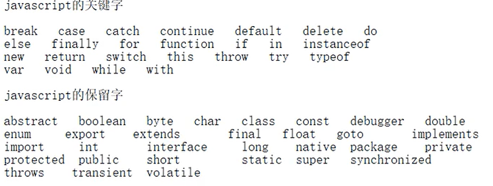

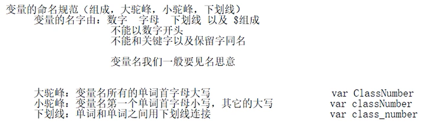

# 3.数据类型

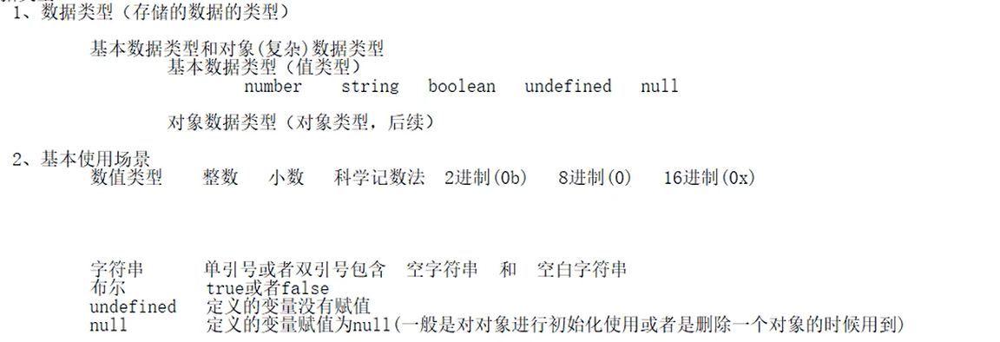

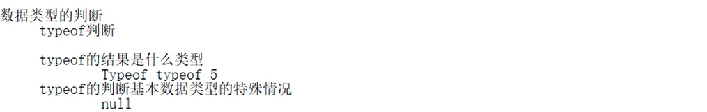

# 4.运算符和表达式

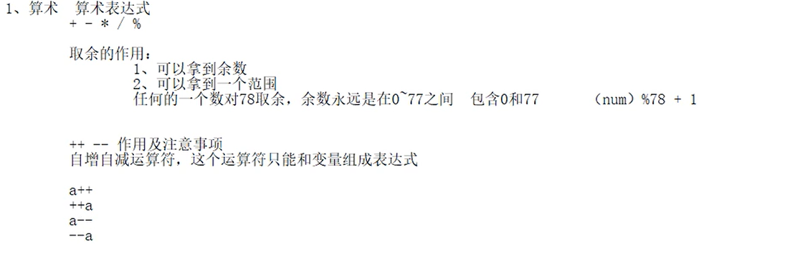

```js
==和===的区别：

			var a='6';
			var b=6;
			var c='7';
			// console.log(a==b);//true
			// console.log(a===b);//true
			console.log(a<c);//true
			// console.log(a===c)//false
			/*
				== 和 === 的区别
				1.==
				如果是同类型的比较大小，如果只不同类型(string，number)的先转换为同类型(string->number)				  的，在比较大小
				2.===
				先判断类型是否一致,如果类型不一致，直接false,
				如果类型一致，在判断大小
			*/
```

# 5.类型转换

## 1.强制数据类型转换

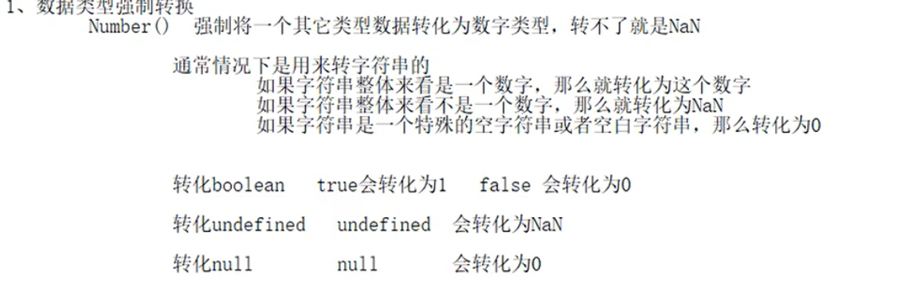

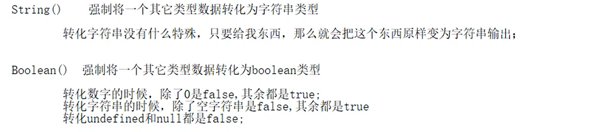

## 2.隐式转换

```js
1.任何和字符串进行+运算，都必须进行拼串
2.任何和NaN进行运算都是NaN
3.进行运算都需要进行转数值
```


## 3.提取数字

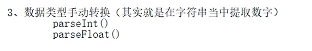


**字符串必须以数字开头，否则直接NaN**

# 6.分支语句

```js
单分支：
if(一般都是一个表达式，但是最终只要有值就行，并且这个值最终会转化为boolean){
   
   }
```

```js
双分支：
if(一般都是一个表达式，但是最终只要有值就行，并且这个值最终会转化为boolean){
   
   }else{
     
   }
```

```js
switch...case:
  switch(有值的东西，最后这里面有一个值，不会进行转化){
    case 1:
    			代码块；
          break；
    case 2:
    			代码块；
          break；
    case 3:
    			代码块；
          break；
    default：
    			代码块；
          break；
  }
```

```js
for循环：
	for(var i=0;i<10;i++){
    document.write("1111")
  }
```

```js
while:
	while(循环条件){
        循环体
        }
```

```js
do...while：
	do{
    循环体
  }while(循环条件)
```

```js
break和continue的区别：
	break：跳出整个循环
  continue：跳出当前次循环，继续下一次循环
```

# 7.函数

```js
1.字面量定义
	function 函数名(){
    
  }

2.表达式定义
	var 函数名=function(){
    
  }
```

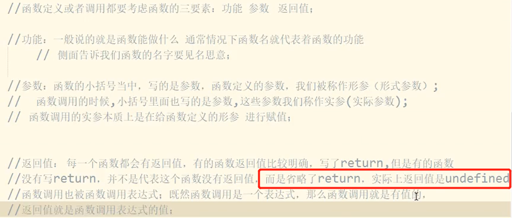

# 8.函数的作用域

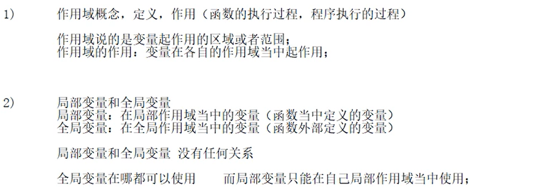

```js
注意点：
	第一种：
	<script type="text/javascript">
			a=10
			//没有var定义a变量，只有直接赋值a=10,
			//此时的a为全局变量
			console.log(a)
			
		</script>

	第二种：
	<script type="text/javascript">
			function f1(){
      //没有var定义a变量，只有直接赋值a=20,
			//同时此时的a在全局中也没有var定义过，这时的a也是全局变量
				a=20;
				console.log(a)
			}
			f1()
			console.log(a)
			
		</script>

总结：没有var定义过的变量，只有赋值时，在全局中也没有定义过，
		他会默认在全局中定义它，它就成了全局变量，例如第二种
```

# 9.程序执行过程

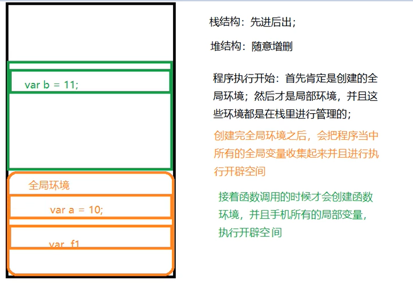

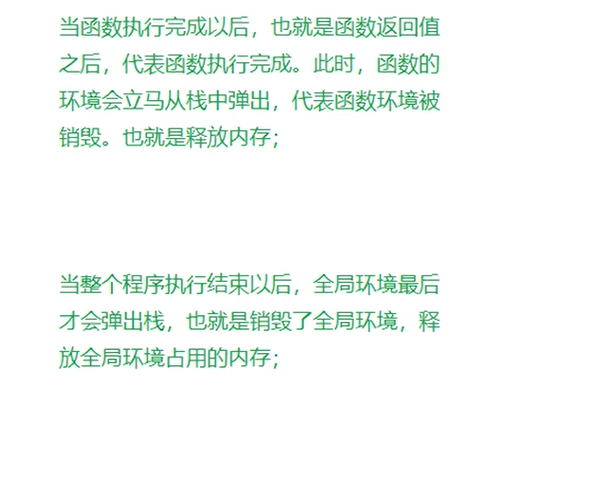

# 10.预解析

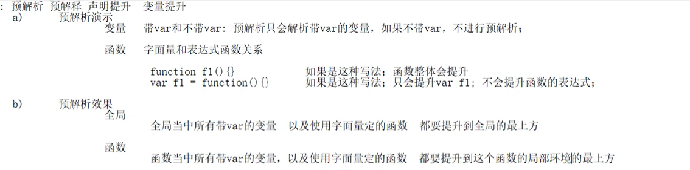

```js
		<script type="text/javascript">
			//提升前
			alert(a)
			var a="我是变量"
			function a(){
				alert("我是函数")
			}
			alert(a)
			
			//提升后
			// var a;
			// function a(){
			// 	alert("我是函数")
			// }
			// alert(a)
			// a="我是变量"
			// alert(a)
			
		</script>

```

# 11.IIFE(匿名函数自调用)

```js
<script type="text/javascript">
			
			// function(){}//本质上是一个匿名函数表达式，但是无法被调用
			
			(function(形参){
				alert("IIFE!")
			})(实参)//函数自调用的写法
			
			(function(a,b){
				var a;
				var b;
				alert(a+b);
			})(10,11)
			/*
				匿名函数自调用的特点：
					1.定义的时候就一起调用了，不会发生预解析
					2.匿名函数自调用只能执行一次，通常用来做一些项目的初始化
				匿名函数自调用的作用：
					1.封装代码实现，不把代码暴露出去
					2.防止污染外部的命名空间
					
			*/
		</script>
```

# 12.arguments实参伪数组

```js
注意点：
	1.js的形参可以不写
  2.arguments可以获取传递的实参
  3.arguments可以使用数组的方法进行操作，但是本身是个对象
  
```

```js
<script type="text/javascript">
			第一种：
			function f1(){
				console.log(arguments)//获取到了10,11
				var a=arguments[0];
				var b=arguments[1];
				alert(a+b)//结果21，需要手动赋值
			}
			f1(10,11)
			
		第二种：
			var a=10
			var b=11
			
			function f1(){
				console.log(arguments)
				var a2;
				var b2
				alert(a2+b2)//可以自动为变量赋值
			}
			
			f1(a,b)
		</script>
```

# 13.对象

## 1.创建对象

```js
<script type="text/javascript">
			//对象的三种定义方式
			//1.字面量
			var obj1={
				name:'张三',
				age:11
			}
			console.log(obj1)
			//2.构造函数
			var obj2=new Object({
				name:'李四',
				age:12
			});
			console.log(obj2)
			//3.工厂方法，实质上还是构造函数
			function createObj(name,age){
				var obj=new Object();
				obj.name=name;
				obj.age=age;
				return obj;
			}
			
			console.log(createObj('王五',13))
		</script>
```

## 2.添加对象属性

```js
	<script type="text/javascript">
			//给对象添加属性
			var obj={};
			var call='call'
			//1.直接添加
			obj.name='张三'
			//2.中括号带引号
			//[方式一和方式二是完全等价的]
			obj['age']=13
			//3.中括号不带引号,不带括号，首先去寻找变量
			obj[call]=function(){
				console.log("叫")
				}
			console.log(obj)
		</script>
引申：[car]就成为了car变量
```

## 3.删除属性

```js
	<script type="text/javascript">
    	var aa='age'
			var obj={};
			
			obj.name='张三'
			obj['age']=13
			
		//删除属性
			delete obj.age
			delete obj['age']
			delete obj[aa]
			console.log(obj)
		</script>
```

## 4.遍历对象

```js
<script type="text/javascript">
			//给对象添加属性
			var obj={};
			var call='call'
			//1.直接添加
			obj.name='张三'
			//2.中括号带引号
			//[方式一和方式二是完全等价的]
			obj['age']=13
			//3.中括号不带引号
			obj[call]=function(){
				console.log("叫")
				}
			
//遍历对象
			for(var key in obj){
        //必须使用[]的方式获取值
				console.log(key,obj[key])
			}
		</script>
```


# 14.this关键字和构造函数

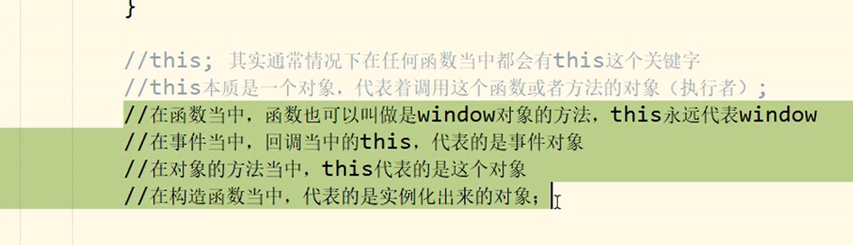

```js
<script type="text/javascript">
			//1.构造函数this指向实例化对象
			function Person(name,age){
				this.name=name;
				this.age=age;
				this.eat=function(){
					console.log(this)
				}
			}
			
			//当做构造函数去执行，this指向实例化对象，返回实例化对象
			var b=new Person('ls',15);
			console.log(b)
			
			//2.普通函数,this指向window
			function f1(){
				console.log(this)
			}
			f1()
			
			//3.对象中的方法(函数),this指向当前对象
			var c=new Person('ls',15);
			c.eat()
			
			//4.事件中，回调函数中this指向事件对象
			
		</script>
```


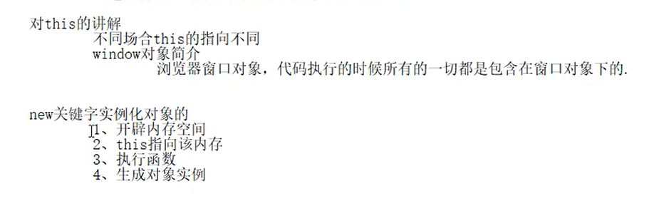

```js
<script type="text/javascript">
			function Person(name,age){
				this.name=name;
				this.age=age;
				var eat=function(){
					console.log("吃饭")
				}
				console.log(this)
			}
			
			//1.当做普通函数去执行，this指向window对象
			//同时因为没有返回值，所以是undefined
			var p=Person('zs',18);
			console.log(p)
			
			//2.当做构造函数去执行，this指向实例化对象，返回实例化对象
			var b=new Person('ls',15);
			console.log(b)
		</script>
```

**构造函数创建对象的内存开辟过程**

```js
1.在栈中开辟全局环境
2.变量提升(扫描变量，函数)
3.在堆中开辟对应空间
4.this指向实例化对象
5.生成实例对象
```


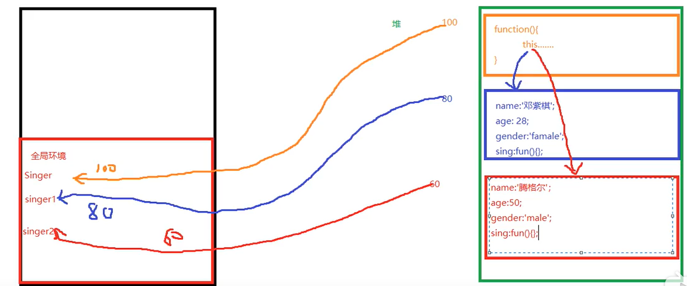


# 15.原型对象和原型链

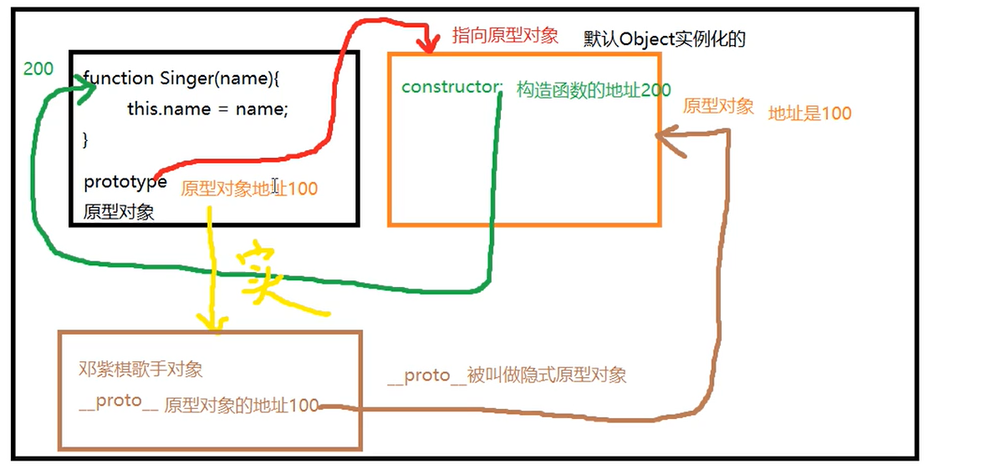

```js
定义：
	任何【函数对象】(必须是函数对象)在定义的时候都会伴随一个原型对象出现，原型对象默认是Object的实例
  
注意点：
	prototype:原型对象
  __proto__:隐式原型对象
  
  1.原型对象出现在构造函数中
  2.实例化对象中只有__proto__隐式原型对象
```

```js
<script type="text/javascript">
			function Person(name,age){
				this.name=name;
				this.age=age;
			}
			//对象方法中的this指向对象
			//将方法放入公共的原型对象中，每个实例化对象都可以看见
			Person.prototype.t=function(){
				console.log('我是:'+this.name)
			}
			var a1=new Person('zs',15);
			var a2=new Person('lis',16);
			a1.t();
			a2.t();
			console.dir(Person)
		</script>
```

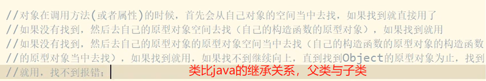

```js
总结：
	1.每一个构造函数都有一个自己的原型对象，而这些不同的构造函数的原型对象都有一个公共的父类原型对象Object原型对象。
  2.构造函数自己的原型对象只对自己以及由自己实例化而来的实例对象可见，别人不可见。
  但是公共的顶级原型对象Object的原型对象则是所有人都可见
```

# 16.apply和call的用法

```js
作用：
	让对象可以调用本身不存在，但是别的对象有的方法
  （改变方法的执行者）
  
  
  <script type="text/javascript">
			function Person(name,age){
				this.name=name;
				this.age=age;
			}
			
			var a1=new Person('zs',55);
			var a2=new Person('ls',54);
			var hit=function(a,b){
				return a+b;
			}
			a2.hit=hit
			console.log(a1)
			console.log(a2)

			var result1=hit.apply(a1,[10,20]);
			var result2=hit.call(a1,20,30);
			console.log(result1);
			console.log(result2);
			onsole.log(result2)
//用法：a1调用a2的hit方法
apply:hit.apply([参数一必须是新的执行对象]a1，[参数二必须为数组][10,20])
call：hit.call([参数一必须是新的执行对象]a1,[后面是hit需要的参数以逗号分隔]10,20)
		</script>
```

# 17.typeof和instanceof的用法

```js
<script type="text/javascript">
			var a=13;//number
			a='111'//string
			a=true//boolean
			a=undefined//undefined
			a=[]//object
			a={}//boject	
			a=null//object
			
			console.log(typeof a)
			
			//1.typeof只能用来区别number，string，boolean，undefined
			console.log(typeof a)
			//2.instanceof只能用来区别数组和构造函数的实例对象
			console.log(a instanceof Array)
			//3.null只能用==来区别	
			console.log(a==null)
</script>
```

# 18.内置对象JSON

```JS
<script type="text/javascript">
			var a={
				name:'zs',
				age:18
			};
//将对象或数组转换成json格式
			var data=JSON.stringify(a);
			console.log(data)
//解析json格式
			var data2=JSON.parse(data)
			console.log(data2)
		</script>
```

# 19.内置对象Math

```js
<script type="text/javascript">
  		//常用数学方法
			//round,ceil,floor,max,min,random,PI,pow
			console.log(Math.round(4.5))//4舍5入
			console.log(Math.floor(2.33))//向下取整
			console.log(Math.ceil(2.33))//向上取整
			
			console.log(Math.max(1,2,3))//最大值
			console.log(Math.min(1,2,3))//最小值
			
			console.log(Math.random())//0-1之间的随机数
			
			console.log(Math.PI)//pai
			
			console.log(Math.pow(3,4))//3的四次方
		</script>
```

# 20.内置对象Date

```js
<script type="text/javascript">
			var date=new Date();
			console.log(date.getFullYear())//获取完整年份 2020
			console.log(date.getDate())//获去具体某一天
			console.log(date.getMonth()+1)//获取月份,月份记得+1
			console.log(date.getHours())//获取小时时间
			console.log(date.getMinutes())//获取分钟时间
			console.log(date.getSeconds())//获取秒级时间
			console.log(date.toLocaleTimeString())//本地的时间 下午2:26:03
			console.log(date.toLocaleDateString())//本地的日期 2020/8/22
			console.log(date.getTime())//从1970年以来的时间毫秒值 1598077563917
			console.log(date.getDay())//星期几
		</script>
```

# 21.包装对象

```js
<script type="text/javascript">
			var a=10;
			a=new Number()//包装对象
			console.log(a.toString())
			
			//当基本数据类型在调用数字，字符串，布尔值的方法的时候，会首先把
			//这个基本数据类型包装成一个对象(临时),然后进行调用包装对象的方法
			//调用完成以后这个临时的包装对象就会立即清除
			
		</script>
使用场景：var a='asdadada'
目的：将a转换成数组
方法：  a[0]
理由:在a这个基本数据类型使用数组的方法是，会被临时包装成一个数组，此时的a就是一个数组类型
```

# 22.严格模式+ES6(let+const)

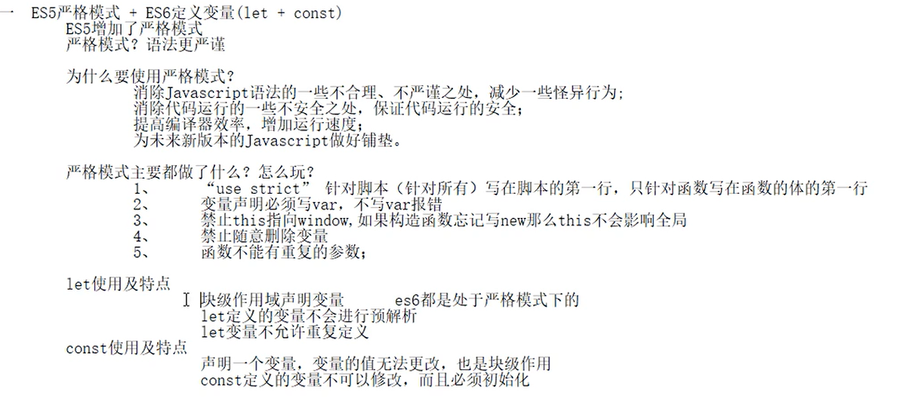

```js
let：申请块级作用域范围的变量
	以前只有全局作用域和局部作用域
类似if（）{
  该处是属于全局或局部的，不能看做单独的作用域
}

但是在使用ES6 let以后
if（）{
  此处成了一个新的块级作用域
}
```

# 22.字符串语法

## 1.charAt

```js
var str='12asdabv123 gdfjrtyj123 jadskhgkiuy123';
console.log(str.charAt(8));//返回下标为8的字符  结果：d
```

## 2.charCodeAt

```js

console.log(str.charCodeAt(8))//返回下标为8的unicode编码  结果：100
```

## 3.concat

```js
console.log(str.concat("zzzzzzzzzzz"))//拼串
```

## 4.fromCharCode

```js
console.log(String.fromCharCode('49'))//返回unicode编码为96的字符 结果:0
```

## 5.indexOf

```js
console.log(str.indexOf('123',7))//返回子串在父串中的第一次的位置，结果：6
//第一个参数必传，第二个可选（代表从哪里开始搜索），查到返回结果，否则返回-1
```

## 6.lastIndexOf

```js
console.log(str.lastIndexOf('123',20))//与indexof作用类似，从后往前搜索
//从下标20处往前搜索	
```

## 7.length

```js
console.log(str.length)//返回字符串的长度
```

## 8.localCompare

```js
console.log(str.localeCompare('11'))//比较字符串的大写(从第一位开始比较,unicode码大的大)返回 -1 0 1
```

## 9.match,replace,search匹配正则

```js
			console.log(str.match(/123/g))//匹配正则子串，返回包含子串的数组
			console.log(str.replace(/123/g,'*'))//替换正则子串
			console.log(str.search(/123/g))//正则搜索,返回子串的位置
```

## 10.split

```js
console.log(str.split(''))//分隔字符，返回数组
```

## 11.slice,subStr,subString

```js
console.log(str.slice(6,-1))//抽取子串，[6,9)
console.log(str.substr(6,3))//抽取子串，下标6，长度3
console.log(str.substring(6,-2))//抽取子串，第二个参数为负数时，代表抽取从0-第一个参数的子串	
```

## 12.大小写

```js
console.log(str.toLocaleLowerCase())//转换成当前国家语言的小写字符
console.log(str.toLocaleUpperCase())//转换成当前国家语言的大写字符
console.log(str.toLowerCase())//转换成小写字符
console.log(str.toUpperCase())//转换成大写字符
```

## 13.tostring

```js
console.log(str.toString())//转换成字符串，所有对象都有的方法
console.log(str.valueOf())//计算值
```

## 14.includes,startWith,endWith,repeat

```js
			//ES6新增语法
			console.log(str.includes('123'))//是否包含123 true、false
			console.log(str.startsWith('12'))//是否已12开头 true、false
			console.log(str.endsWith('123'))//是否已123结尾 true、false
			console.log(str.repeat(2))//返回字符串重复调用2次之后的结果
```

# 23.数组语法

## 1.cocat

```js
var arr=[1,7,3,11,5]
console.log(arr.concat(4,5,6))//返回一个新的数组[1,2,3,4,5,6]
console.log(arr.concat([4,5,6]))//返回一个新的数组[1,2,3,4,5,6],如果参数是数组，会被拆解然后拼接
```

## 2.length

```js
console.log(arr.length)//返回数组的长度 3
```

## 3.join

```js
console.log(arr.join('*'))//将数组转成一个新的字符串，默认以逗号分隔 1*2*3
```

## 4.reverse

```js
console.log(arr.reverse())//将原数组翻转 3,2,1
```

## 5.slice

```js
console.log(arr.slice(1,3))//抽取一个新的数组下标[1,3)
```

## 6.sort

```js
			console.log(arr.sort())//将原数组排序，不传递参数,默认字符串比较(编码)

			console.log(arr.sort(function(a,b){
				return b-a;
			}))//将原数组排序，参数必须为一个函数，当a-b时，升序，b-a时，降序


			//1.按条件排序（id）
			var arr2=[{id:10},{id:9},{id:11},{id:1}]
			console.log(arr2.sort(function(a,b){
				return a.id-b.id
			}))


			//2.多条件排序
			var arr3=[{id:10,age:15},{id:9,age:17},{id:10,age:9},{id:1,age:16}]
			console.log(arr3.sort(function(a,b){
				if(a.id===b.id){
					return b.age-a.age;//age降序
				}else{
					return a.id-b.id;//id升序
				}
				
			}))
```

## 7.push,pop,unshift,shift

```js
			console.log(arr.push('aaa'))//在原数组上末尾新增一个，并返回新数组的长度
			console.log(arr.pop())//在原数组上末尾删除一个，并返回删除的元素
			
			console.log(arr.unshift('bbb'))//在原数组上头部新增一个，并返回新数组长度
			console.log(arr.shift())//在原数组上头部删除一个，并返回删除元素
```

## 8.重点splice

```js
			//重点splice 可增，可改，可删 
			//参数解析：第一个参数：下标
			//		   第二个参数：删除元素的个数
			//		   第三以至于更多：新增的数据
			console.log(arr.splice(2,0,'zl'))//在原数组下标2处新增'zl'，返回删除的元素组成的数组，这里是空[]
			console.log(arr.splice(2,1))//在原数组上删除下标2的一个元素，返回删除的元素'zl'组成的数组
			console.log(arr.splice(2,2,'zly','ym'))//在原数组上把下标2的值更换为'zly',返回删除的元素组成的数组
			
			console.log(arr.toString())//将数组转成字符串
			console.log(arr.toLocaleString())//将数组转成字符串
```

## 9.indexOf,lastIndexOf

```js
var arr=[1,7,3,11,1]
console.log(arr.indexOf(11,1))
console.log(arr.lastIndexOf(1,1))
```

## 10.forEach

```js
//只能遍历数组，没有返回值
			console.log(arr.forEach(function(item,index){
				console.log(item)
			}))
```


## 11.map

```js
//遍历数组的同时，可以处理数组，并且，返回一个新的数组
			console.log(arr.map(function(item,index){
				return item*2;
			}))
```

## 12.filter

```js
//返回满足过滤条件的新数组
			console.log(arr.filter(function(item,index){
				return item<2;
			}))
```


## 13.es6新语法from，of，find，findIndex

```js
			var str='asdada0'
			console.log(Array.from(str))//将字符串转成数组
			console.log(Array.of('ss',11,'ls'))//将参数转成数组
			
			//返回第一个符合条件的元素
			console.log(arr.find(function(item,index){
				return item>10
			}))
			
			//返回第一个符合条件的元素的下标
			console.log(arr.findIndex(function(item,index){
				return item>10
			}))

```

# 24.dom概念

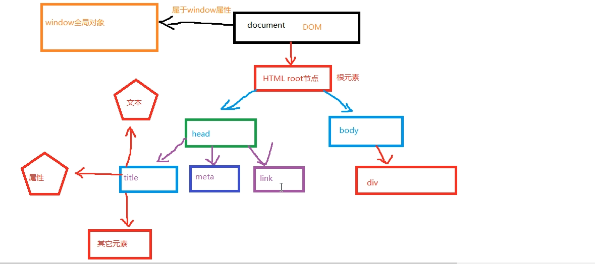