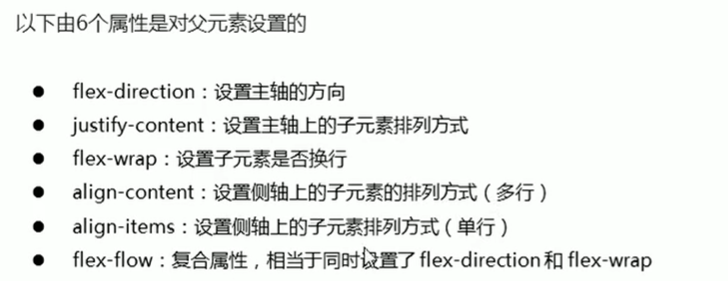

# 1.父元素属性



```html
flex-direction：设置主轴
	row： 默认从左到右
  row-reserve：从右到做
	column：从上到下
  column-reserve：从下到上
```

```html
justify-content：设置子元素在主轴上的排列方式
	flex-start:默认从头部开始，如果主轴是X,则从左到右
	flex-end:从尾部开始
  center：在主轴居中对齐
  space-around：平分剩余空间
	*space-between：先两边贴边在平分剩余空间

```

```html
flex-warp：设置是否换行，默认不换行
nowrap：默认不换行
warp：换行
```

```html
align-items：设置侧轴上的子元素排列方式（单行内容）
flex-start：默认从上到下
flex-end：从下到上
center：垂直居中
stretch：拉伸
```

```html
align-content:设置侧轴上的子元素排列方式（多行内容，是否主轴换行）
flex-start：默认从上到下
flex-end：从下到上
center：垂直居中
stretch：拉伸
space-around:子元素在侧轴平分剩余空间
space-between：子元素先分布两头，在平分剩余空间
```

```html
flex-flow:符合写法
flex-direction和flex-wrap的符合写法

flex-direction：row
flex-wrap：wrap

flex-flow:row wrap


```

# 2.子元素属性

```html
flex:定义子元素分配剩余空间时，用flex来占几份
flex：1
```

```html
align-self:控制单个子元素
```

```html
order:控制显示顺序，数值越小，越靠前
```

