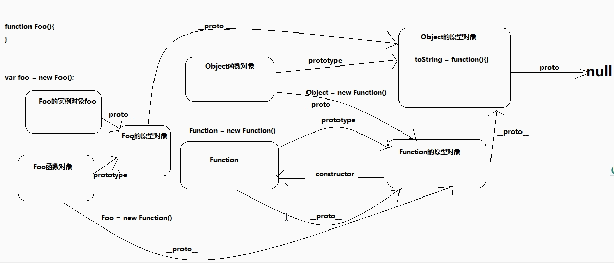
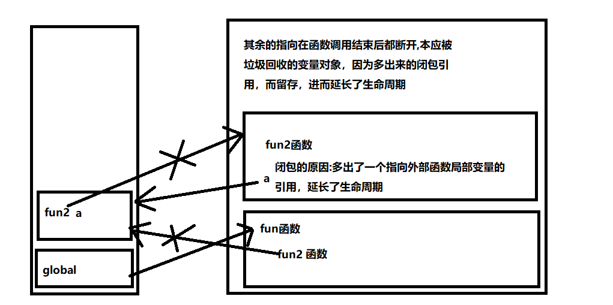

# 1.js真正只有一个堆内存

我们常说的栈内存和堆内存都只有js唯一堆内存的两个分区

如何证明：。。。

# 2.call、apply用法牢记

```html
call,apply作用：修改this的指向
call和apply的区别：
	call多个参数：接连往后写
  apply多个参数：都写在一个数组中
var obj={
  name:'zs'
}

function test(num){
  console.log(this,num)//this指向window
}

test.call(obj,123)//this指向obj,
test.apply(obj,[123])
```

# 3.回调函数

js中的核心是函数，函数的核心是回调函数

```html
什么是回调函数：
	1.你定义了
  2.你没有执行
  3.但是最终执行了
```

# 4.函数知识

```html
1.函数
	1.函数是特殊的对象
  2.函数具备行为，可以被调用
  3.函数用来减少代码量，提高复用，进一步提高了系统效率
  4.隔离变量，减少命名污染
2.函数分类
	1.普通的函数
  2.构造函数
  3.IIFE(匿名自调用函数)
	4.回调函数
  
*3.函数的this
		1.理解this
    	1.this是关键字
      2.this是一个变量
    2.this的指向问题
    	1.函数this不是函数定义的时候决定的
      2.函数this指向是看如何调用的
    3.this指向分类
    	1.函数自调用：window
      2.fn()普通调用：window
      3.构造函数(new fun()):当前构造函数的实例
      4.obj.test():对象本身
      5.fun.call/apply(新对象):新对象	
	
```

# 5.IIFE(匿名函数自调用)

```html
形式：
1.	(function(){
		console.log('IIFE')  
		})()
2.  (function(){
  	console.log('IIFE  2')
		}())

区别：一个括号在里面，一个括号在外面
作用:作用是一样的，自调用
常见应用场景：只使用一次，并且页面刷新就要使用的时候
```

# 6.new操作符

```html
1.创建一个空对象
2.将this指向这个空对象
3.调用函数
4.返回结果
```

# 7.原型对象

```html
1.什么是原型对象
	1.每个实例都有一个prototype属性，该属性指向的是原型对象(显示原型对象)
	2.每个实例对象身上都有一个_proto_属性，该属性指向的也是原型对象(隐式原型对象)
	3.构造函数的显示原型===当前构造函数的实例的隐式原型对象

2.原型对象的本质
	普通的Object对象的实例
  
  
什么叫显示原型对象:
	可以直接调用的原型对象属性fn.prototype
什么叫隐式原型对象:
	不可调用的原型对象属性_proto_
```

# 8.原型链

```html
什么是原型链
	1.查找对象的属性的时候，先找自身，如果没有沿着__proto__找原型对象
  2.如果原型对象上没有，继续沿着__proto__找原型对象的原型对象
  3.如果还没有找到返回undefined
  4.原型链：沿着__proto__查找的这条线就叫做原型链
  
*顶级原型对象Object的__proto__=null
代表，原型链到他停止。
```



# 9.instanceof

```html
作用：判断对象和数组
语法：A instanceof B 

原理：根据原型链从A的原型开始，一直向上查找知道Object的原型对象，只要B的原型对象出现在其中某个节点上，就可以认为A 是 B 的实例
```


# 10.变量提升，函数提升

```html
1.js引擎在js代码在正式执行之前会做一些预解析的工作
2.找关键字：var function
3.找到var之后将var后面的变量提前申明，但是不赋值
4.找到function以后定义对应的函数，也就是说函数在预解析的时候已经定义完毕
5.注意：
	1.全局预解析在定义函数的时候不关心函数是否被使用
  2.函数局部预解析的时候如果内部函数没有被使用就不会提前定义
```

# 11.执行上下文

```html
1.理解
	执行上下文抽象的概念，代表了代码执行的环境，包含：执行环境，变量对象，this，作用域链 
2.流程
	1.js引擎在js代码正式执行之前，会先创建一个执行环境
  2.进入该环境以后创建一个变量对象，改对象用于收集当前环境下：变量，函数，函数的参数，this
  	1.变量提升，函数提升
  3.确认this的指向
  4.创建作用域链
```

# 12.作用域

```html
1.作用域的理解
	1.他是抽象的概念
  2.是用来决定代码执行的范围，变量所属的范围
  3.作用域是代码定义的时候决定的
  作用：
  	1.隔离变量
    2.规定其之后的作用域链是什么样的，体现：[[scopes]]

2.作用域链
	1.作用域链是一个数组结构
  2.该结构内保存的是一个个的变量对象
```

# 13.*闭包

```html
1.闭包产生的条件
	1.函数嵌套
  2.内部函数引用外部函数的局部变量
  3.调用内部函数
  
例如:
		function f1(){
			var b=5
			function f2(){
				console.log(b)
			}
			return f2
		}
		f1()

2.什么是闭包
	1.闭包是一个存在内部函数的引用关系
  2.该引用指向的是外部函数的局部变量对象（前提是内部函数使用了外部函数的局部变量）
  
3.闭包的作用
	1.优长外部函数变量对象的生命周期
  2.缺点：
  2.让外部函数可以操作函数内部的数据（变量/函数）
	注意：
  	1.浏览器为了性能，后期将外部函数中不被内部函数使用的变量清除了
    
4.闭包的优缺点
	1.优点：延长外部函数变量对象的生命周期
  2.缺点：延长外部函数变量对象的生命周期（长期占有内存，有内存泄漏的可能）
  
5.使用闭包的时候注意点
	1.及时清除闭包
  2.让内部函数称为垃圾对象-->内部函数身上没有指针指向fun=null
```



# 14.作用域分类

```html
作用域分类：
	1.静态作用域（词法作用域）html
  2.动态作用域：bash
  
对比：
	1.词法作用域规定作用域在代码定义的时候就决定了，而不是看调用的时候
  2.动态作用域是在代码执行的时候决定的
```

# 15.对象的注意点

```html
1.对象中所有的key都是字符串
2.obj.toString()="[object Objeect]"

2.对象的创建方式
	1.Object构造函数   var obj=new Object()
  2.字面量           var obj={name:'zs'}
  3.工厂函数				function Person(){
    								return {
                      name:'zs'
                    }
  								}
									var person1=Person()
		工厂模式创建出来的不是Person的实例，只是工厂模式的返回值
    
   4.自定义构造函数	 function Person(name){
    								this.name=name
  									}
   									var obj=new Person('zs')
   5.构造函数加原型对象的组合模式
   									function Person(name){
    								this.name=name
  									}
										Person.prototype.showName=function(){}
   									var obj=new Person('zs')
```

# 16.原型链继承

```html'
原型继承原理：使子类称为父类的实例

function Person(name){
	this.name=name
}
Person.prototype.showName=function(){
	console.log(this.name)
}
var person1=new Person('zs')

//原型继承，需要注意此时child的构造器会丢失，需要手动指定
Child.prototype=new Person()
//指定构造器
Child.prototype.constructor=Child

function Child(name){
	this.name=name
}

var child1=new Child('lisi')
child1.showName()
```

# 17.借用构造函数继承

```html
function Person(name,age){
	this.name=name
  this.age=age
}

function Child(name,age,sex){
	//this.name=name
  //this.age=age
  
  //借用构造函数继承
  Person.call(this,name,age)
  this.sex=sex
}
```

# 18.组合继承(构造继承+原型继承)

```html
function Person(name,age){
	this.name=name
  this.age=age
}

//原型继承，需要注意此时child的构造器会丢失，需要手动指定
Child.prototype=new Person()
//指定构造器
Child.prototype.constructor=Child


function Child(name,age,sex){
	//this.name=name
  //this.age=age
  
  //借用构造函数继承
  //此处this的原理：构造函数(new fun()):当前构造函数的实例
  //this执行当前构造函数的实例对象
  Person.call(this,name,age)
  this.sex=sex
}


var child1=new Child('zs',18,'male')
```

# 19.js单线程

```html
1.js代码是单线程的，代码会阻塞

2.js代码分两种
	1.同步代码：
  	1.同步会阻塞后续代码的执行
    2.同步没有回调
  2.异步代码
  	1.异步是非阻塞的
    2.异步有回调
```

#  20.json

```html
转成json格式
var obj={name:'zs'}
obj=JSON.stringify(obj)

从json转化为obj
obj=JSON.parse(obj)
```


# 21.*Object.create()

```html
Object.create(prototype,[propertites])
作用：以指定对象为原型创建新的对象，并可以增加新的属性
value：属性值
writable：是否可以修改，默认false
configurable：是否可以被删除，默认false
enumerable：是否可以用for in遍历，默认false


示例：
var obj={
  name:'zs'
  showName:function(){
    console.log(this.name)
  }
}

var obj2=Object.create(obj)//空对象，原型是obj

var obj2=Object.create(obj,{
  age:{
    value:18,
    writable:true,
    configurable:true,
    enumerable:true
  }
})


需要配合Object的一个方法来只输出本身的属性，否则会将原型的属性一并输出
Object.hasOwnProperty(i)
```

# 22.*Object.definePropertites()

```html
Object.definePropertites(obj,props)
作用：为指定obj拓展多个属性
get：用来获取当前属性值的回调函数
set：用来设置当前属性值的回调函数

var obj2=Object.definePropertites(obj,props)
隐含作用：obj的属性修改，obj2的属性也会修改，反之亦然

案例：
var obj={
		  name:'zs',
		  age:18
		}
		
var obj2={}
//复制属性
//1.遍历属性
for(var i in obj){
  (function(i){
    Object.defineProperties(obj2,{
      [i]: {
        get:function(){
          console.log('get()')
          return obj[i]
        },
        set:function(msg){
          console.log('set()',msg)
          obj.name=msg
        }
      }
    })
  })(i)
}

console.log(obj)
console.log(obj2)
obj2.name='lisi'

思考：函数自调用
在js中如果需要遍历的每个属性都有与之对应的操作，应该考虑使用函数自调用配合


原因：在产生操作之前，遍历已经完成，保存的数据就成了最后一个数据

解决方法:函数自调用，在每次遍历都调用一次，即可使每次操作都有对应的数据
```

